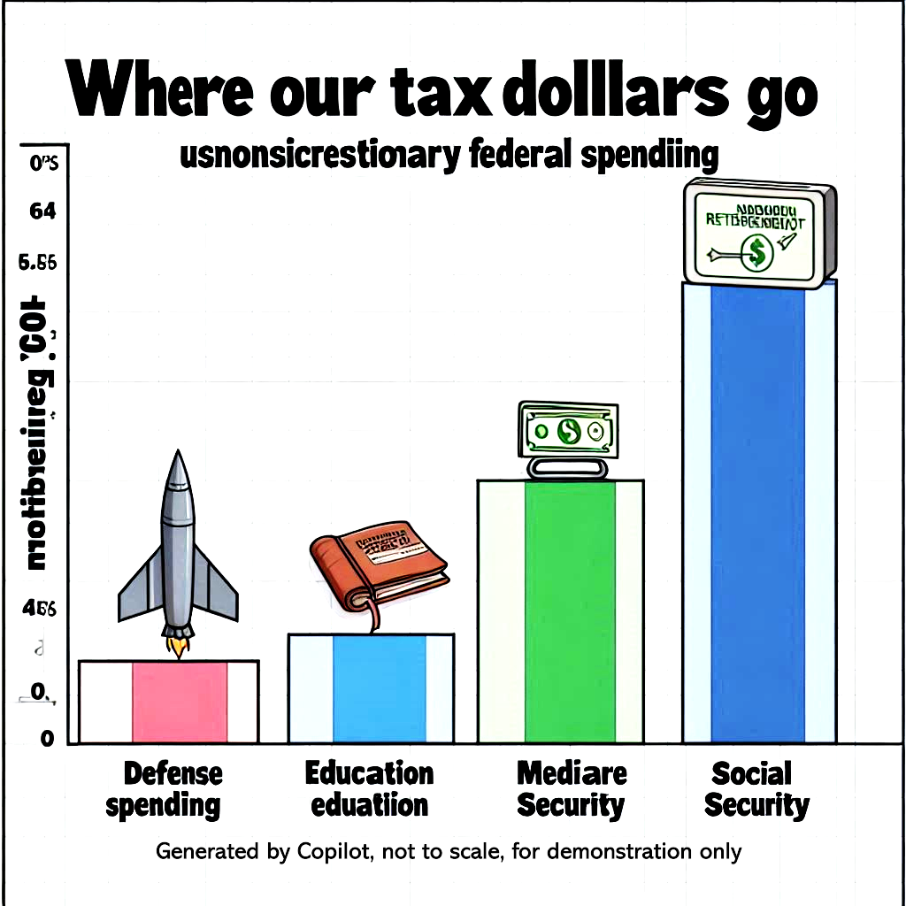

## Agenda

- Today
        
        - Lecture: Misinformation
        - Discussion: Disinformation and Civil Discourse

    
- Tuesday

        - Lecture: Civil Liberties
        - Discussion: Civil Liberties and Majority Power

## Assignments

- There are 3 types of assignments for points in this class

        - To earn full points, you must do all three
        - They cover the material from different angles, so they are related, but they are not the same
        - Connect and Journals cover individual chapters 
        - The Study Guides cover the full module including lecture, textbook, and assigned readings

1. Connect assignments 

        - these are the e-book/textbook chapter assignments
        - the chapters for each Module are linked from the Module
        - The instructions are in the e-book should you need help
        
        
## Assignments (page two)

2. Journal assignments 

        - These are written assignments based on the textbook chapters
        - There are 4 options for how to complete
        - Options means you pick one of the four
        - Each journal topic is 600 words or two handwritten pages
        - Full instructions are in Canvas
        
3. Study Guides

        - These are also written assignments but are based on the entire module
        - These are based on textbook, lecture, and potentially assigned readings
        - Each Study Guide is 600 words or two handwritten pages TOTAL
        - You pick the questions to answer
        - Full instructions are in Canvas
        
        

## Upcoming Dates

- Module 2 Study Guide Due - July 24, 11:59 PM
- Module 2 Quiz - July 27, 11:59 PM
- Connect assignments due July 27, 11:59 PM

        - Chapters 6, 7, 8, 9, 10, and 11
        
- Journals due July 27 in class

        - Chapters 6, 7, 8, 9, 10, and 11
        - Three assigned readings from The Federalist
        - Some readings are half length journals and some are combined to make the total word count the same for the Module - see Canvas instructions
        - Full instructions in Canvas in Module 2
        

 

# Misinformation

## Misinformation, Disinformation, and Information Consumers

::: {.custom-style style="font-size: 80px;"}
Who are information consumers?

Who needs useful, correct information?
:::

## Misinformation, Disinformation, and Information Consumers

- Information consumers: US! The people receiving and acting on the information

## Misinformation, Disinformation, and Information Consumers
- Information consumers: US! 

## Misinformation, Disinformation, and Information Consumers

::: {.custom-style style="font-size: 80px;"}
What is misinformation?
:::

## Misinformation, Disinformation, and Information Consumers

::: {.custom-style style="font-size: 80px;"}
Misinformation: false or misleading information that is **unknowingly** shared
:::

## Misinformation, Disinformation, and Information Consumers

- Misinformation: false or misleading information that is **unknowingly** shared

        - Someone shares a meme that they think is true, but it is false
        - Someone shares a rumor
        - Someone shares a news story that is false, perhaps purposely planted
        - Someone misinterprets satire and shares it as fact

## Misinformation, Disinformation, and Information Consumers

::: {.custom-style style="font-size: 80px;"}

What is disinformation?

:::

## Misinformation, Disinformation, and Information Consumers

::: {.custom-style style="font-size: 80px;"}

- Disinformation: false or misleading information that is **purposely** created and distributed
:::

## Misinformation, Disinformation, and Information Consumers

- Disinformation: false or misleading information that is **purposely** created and distributed

                - Lies: complete falsehoods
                - Planted false news stories
                - Out of context: missing surrounding words and circumstances, real meaning may be the opposite
                - Unusual definitions: different meaning than normal speech of the *information consumer* 

                
                
## Misinformation, Disinformation, and Information Consumers
- Information consumers: US! 
- Misinformation: unknowingly shared
- Disinformation: purposely created and distributed
                
## Three kinds of lies

::: {.custom-style style="font-size: 80px;"}

**“There are three kinds of lies: lies, damned lies, and statistics.”** 

:::

Related: **"Liars, damned liars, and experts!"**

Attributed to:

                - Benjamin Disraeli
                - Mark Twain
                - Aldous Huxley
                - Leonard Henry, Baron Courtney of Penwith
                

## 55% of Budget for Defense

## 55% of Budget for Defense

- This meme is disinformation with a footnote
- The number is for the "discretionary" budget, which is only about 27% of the budget
- Does not include state and local spending, which is about 45% of government spending
- There is virtually zero defense spending in the nondiscretionary budget 

## The real number

- 55% x 27% = 15% of the total federal budget

- 15% x 55% = 8.25% of total government spending

- Nondiscretionary and state/local defense spending may add a few percent so

- **Defense: 8.25% to 10%** of total government spending

- **Everything else: 90 to 91.75%** of total government spending

## Unusual Definitions/Lack of Context

## Unusual Definitions/Lack of Context

::: {.custom-style style="font-size: 80px;"}
This meme doesn't even have the footnote!
:::

- Doesn't say that this is discretionary spending
- Doesn't give a source

## Unusual Definitions/Lack of Context

::: {.custom-style style="font-size: 80px;"}
If I told you that there is virtually no nondiscretionary defense spending, what would the picture look like if we did the same thing for the nondiscretionary budget?
:::

## Unusual Definitions/Lack of Context

Note - this is a hypothetical, AI generated using Copilot and not accurate

## Unusual Definitions/Lack of Context

- These memes **purposely** confuse two different things

Simple definitions:

                - Discretionary: set in every budget
                - Nondiscretionary: set far in advance
                - Total budget: Discretionary plus Nondiscretionary
                
- This shows only discretionary spending

                - Most spending on the little categories is nondiscretionary
                - Virtually all defense spending is discretionary

- If we show the total budget, the picture changes drastically
- If we show only nondiscretionary, the rocket disappears

## Why is this a problem?

::: {.custom-style style="font-size: 80px;"}
Suppose you believe the United States should spend less on defense and more on these other priorities, what is wrong with these memes?
:::

## Why is this a problem?

"This week on Facebook I ran into a couple of memes about the defense budget that I thought were worth addressing. While the **core message that the United States spends too much on the military is sound**, these particular memes are so **massively misleading** that I think it would be irresponsible to let them go unanswered..."

[Human Economics](https://patrickjuli.us/2015/09/30/how-not-to-talk-about-the-defense-budget/)

## Why is this a problem?

::: {.custom-style style="font-size: 60px;"}
Suppose you believe the United States should provide college for free like Germany, France, Finland, Sweden, or Norway, what is wrong with these memes portrayal of education spending? Spending is the problem, right?
:::

## Why is this a problem?

::: {.custom-style style="font-size: 60px;"}
"Our education spending is about average (though somehow we do it so inefficiently that we don’t provide college for free, unlike Germany, France, Finland, Sweden, or Norway)...How about a meme about that?"
:::

[Human Economics](https://patrickjuli.us/2015/09/30/how-not-to-talk-about-the-defense-budget/)

## Practical and Moral Dimension

- Practical issues:

                - Does the dishonest information distract from real root causes?
                
## Practical and Moral Dimension

- Practical issues:

                - Does the dishonest information distract from real root causes?

                - What happens if someone arguing for something gets caught lying? What do the people listening think?
                

## Practical and Moral Dimension

- Practical issues:

                - Does the dishonest information distract from real root causes?

                - What happens if someone arguing for something gets caught lying? What do the people listening think?
                
                
- Moral Dimension

                - Do you personally want to unknowingly spread disinformation?

## Just to be clear

::: {.custom-style style="font-size: 50px;"}
The two examples are obvious, easily refuted, egregious examples from the left. This isn't limited by party or ideology.
:::

## Extra Credit Quiz Answers

The Extra Credit Quiz Answers are based on actual federal budget data from the US Department of the Treasury from **2021 fiscal year**:

[Preview](https://fiscaldata.treasury.gov/americas-finance-guide/federal-spending/){target="_blank" rel="noopener noreferrer" preview-link="false"}

Goals: Understand the problems. Understand the solutions. Argue more effectively for what you want. Don't spread misinformation and look dishonest. 

## Healthcare vs Defense Spending               

## Question 1

Of the four following categories, which does the federal government spend the most on?

a. police
b. national defense
c. healthcare
d. veteran's benefits

## Question 1: Answer 

Of the four following categories, which does the federal government spend the most on?

Correct answer C

a. police - in "other" category, unknown share of 4%
b. national defense - 13% of budget
c. HEALTHCARE - 14% plus 12% for Medicare
d. veteran's benefits - 4% of budget

## Healthcare vs Defense Spending   

Honest meme: Healthcare should be twice as big as defense!

# Social Spending: Is this true?

“It just happens,” [Senator Bernie Sanders] said. “We don’t worry about people sleeping out on the street...”

https://thehill.com/homenews/senate/4124631-these-11-senators-voted-against-the-must-pass-defense-spending-bill/

## Question 2 

Of the following categories of spending, which does the federal government spend the most on?

                a - interest on the national debt
                b - national defense
                c - social welfare spending
                d - transportation
                

## Question 2: Answer 

Of the following categories of spending, which does the federal government spend the most on?

Correct answer: C - social welfare spending

                a - interest on the national debt - 9%
                b - national defense - 13%
                c - social welfare spending - 65% including healthcare, 39% excluding healthcare. Does NOT include veteran's benefits!
                d - transportation - 2%

# Social Spending: Is this true?

Based on the budget, this isn't true at least for federal spending. 

Not based on private charitable spending *as a percent of national income* either [List of countries by charitable spending](https://en.wikipedia.org/wiki/List_of_countries_by_charitable_donation_as_percentage_of_GDP)

“It just happens,” [Senator Bernie Sanders] said. “We don’t worry about people sleeping out on the street...”

                                - [source:](https://thehill.com/homenews/senate/4124631-these-11-senators-voted-against-the-must-pass-defense-spending-bill/)

                
## Election Budget vs Healthcare Spending

## Question 3

Of the following categories of spending, which does the federal government spend the most on?

                a - customs and immigration
                b - healthcare
                c - national defense
                d - veteran's benefits

## Question 3: Answer

Of the following categories of spending, which does the federal government spend the most on?

Correct answer: b - HEALTHCARE - $741 billion plus $657 billion for Medicare vs $2 billion for that election

                a - customs and immigration - included in "other" less than 4%
                b - healthcare - 27% including Medicare, 14% without Medicare
                c - national defense - 13%
                d - veteran's benefits - 4%
                
## Election Budget vs Healthcare Spending

TRUE MEME: We already spend $1,398 billion on healthcare. How much difference would $2 billion more make?

RESPONSE MEME: If free healthcare only cost $6.06 per person, why does it even need to be free? I'll pay for mine and 100 other people and still save money!

## Biden Cutting Social Security

Disclaimer: I have no idea if these are true. It's just related.

## Question 4

If we combine national defense spending and veteran's spending to create a category called "defense related spending," which of the following categories gets the largest share of federal spending?

                a - defense related spending
                b - Social Security
                c - Medicare

## Question 4: Answer

If we combine national defense spending and veteran's spending to create a category called "defense related spending," which of the following categories gets the largest share of federal spending?

Correct Answer: b - Social Security

                a - defense related spending - 17%
                b - Social Security - 21%
                c - Medicare - 12%
                
                
## Trump Cutting Social Security

Disclaimer: No idea if this is true either, it's just funny given the Biden meme!

## Question 5

Which of these gets the largest share of federal spending? Consider these categories:

                a. Courts and police of all types
                b. Defense related = national defense plus veteran's benefits and services
                c. Senior citizens benefits = Social Security and Medicare
                d. Welfare for non-seniors

## Question 5

Which of these gets the largest share of federal spending? Consider these categories:

Correct Answer: C - Senior citizens benefits at 33%
d. Welfare for non-seniors is close at 32%

                a. Courts and police of all types - less than 4%
                b. Defense related = national defense plus veteran's benefits and services - 17%
                c. Senior citizens benefits = Social Security and Medicare - 33%
                d. Welfare for non-seniors - 32% 

## Authorship and License

Do not submit to Quizlet, Chegg, Coursehero, or other similar commercial websites.

- Author: Tom Hanna

- Website: <a href="https://tom-hanna.org/">tomhanna.me</a>

- License: This work is licensed under a <a href= "http://creativecommons.org/licenses/by-nc-sa/4.0/">Creative Commons Attribution-NonCommercial-ShareAlike 4.0 International License.</a>

