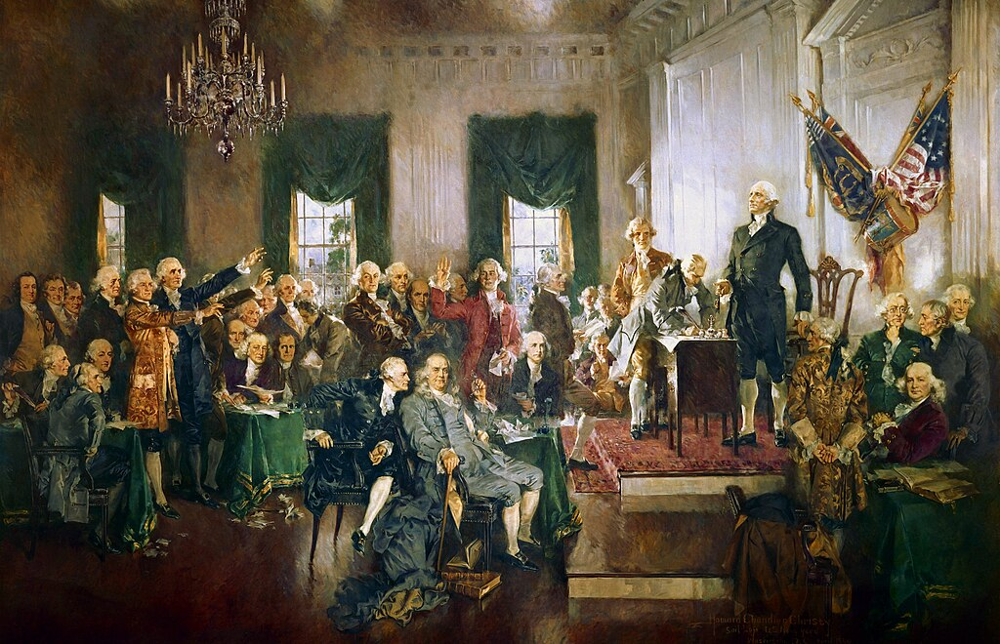

## Today

- Why government arises
- Collective action problems
- Olson: stationary bandit (empirical)
- Locke: social contract (normative)
- Discussion

# Why This Matters

## Why This Matters

::: {.custom-style style="font-size: 55px;"}
By the end of today you will explain two answers to “where does government come from?” — one empirical, one about rights and legitimacy — and why both matter for limiting power.
:::

## Bridge

- Government = organized coercive force accepted as legitimate
- Ethics + founding values → limits
- Today: *why* that force appears at all

# Collective Action

## The problem

::: {.custom-style style="font-size: 55px;"}
Rational individual choices ≠ optimal group outcomes
:::

## Ostrom

::: {.custom-style style="font-size: 50px;"}
Failure of collective action is the “core justification for the state.”
:::

— Elinor Ostrom

## Prisoner’s Dilemma

{width="90%"}

## Prisoner’s Dilemma

[Prisoner’s Dilemma Explained](https://youtu.be/TJCGTNIwmv8)

## Prisoner’s Dilemma

- Best personal move can make both worse off
- Talk without enforcement is cheap
- Enforcement → core use of state coercion

## Free rider

{width="70%"}

## Free rider

::: {.custom-style style="font-size: 55px;"}
Everyone benefits if someone else does the work
:::

## Public goods

- Roads, parks, clean air, clean water
- Security — the first public good

## Security

::: {.custom-style style="font-size: 55px;"}
No central authority: who provides? Who pays?
:::

# Olson — Empirical Origin

## Two coercive actors

{width="90%"}

## Roving bandit

::: {.custom-style style="font-size: 55px;"}
Plunder, move on — no incentive to protect production
:::

## Stationary bandit

::: {.custom-style style="font-size: 50px;"}
Stay, monopolize force and taxation — incentive to foster order
:::

## Genesis of the state

::: {.custom-style style="font-size: 50px;"}
Ruler’s long-term interest can align with a stable, productive society
:::

## Olson in one line

::: {.custom-style style="font-size: 55px;"}
Empirical story: order can grow out of self-interested violence
:::

# Locke — Rights and Legitimacy

## State of nature

::: {.custom-style style="font-size: 50px;"}
Not war of all against all — law of nature, free and equal
:::

## Inconveniences

- No known settled law
- No neutral judge
- No reliable enforcement

## The contract

{width="85%"}

## Purpose of government

::: {.custom-style style="font-size: 55px;"}
Preservation of property — life, liberty, possessions
:::

## Rights first

::: {.custom-style style="font-size: 55px;"}
Government protects pre-existing rights — it does not create them
:::

## A rare real contract

{width="90%"}

## US founding documents

::: {.custom-style style="font-size: 50px;"}
A rare instance of the real thing: consent, rights, right to alter or abolish
:::

# Two Models

## Olson vs Locke

{width="90%"}

## Two jobs

| Olson | Locke |
|-------|--------|
| Empirical origin | Normative legitimacy |
| Incentives & violence | Rights & consent |
| Where states come from | Why we may limit them |

## Conceptual maps

{width="85%"}

## Not history lessons

::: {.custom-style style="font-size: 55px;"}
Simplified maps — major structures, not every street
:::

# Discussion

## Discussion

- Does Olson’s story make government look more dangerous — or more inevitable?
- Does Locke’s contract still bind people who never signed?

# Next

## Next class (September 2): Constitutional Safeguards

Come ready to connect origins → *how* the Constitution tries to limit the force it authorizes.

## Reminders

- Module 0 substantially complete by **August 30** (avoid drop)
- Module 1 Study Guide and Connect due **September 18**

## Authorship and License

Do not submit to Quizlet, Chegg, Coursehero, or similar commercial sites.

- Author: Tom Hanna
- Website: [tomhanna.me](https://tom-hanna.org/)
- Graphics: Gemini-generated diagrams unless noted; Constitution signing — Howard Chandler Christy, public domain
- License: [CC BY-NC-SA 4.0](http://creativecommons.org/licenses/by-nc-sa/4.0/)

