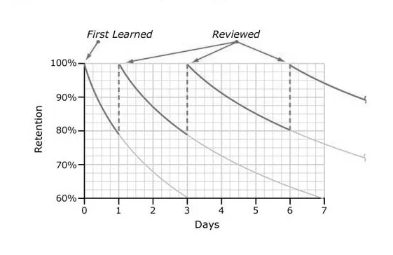

# First Week's Agenda

## Day 1

        - Course Outline/Procedures, Overview of Objectives
        - Introductions
        - Brief overview of Canvas
        - Study tips
        - Question and answer

## Day 2

        - Introduction to the topic of government: What is Government? What is Politics?
        - Activities/Discussion: Experiences with Government
        - Question and Answer
  
## Due Dates Begin Immediately

This Week (Module 0 - avoid non-attendance drop)

        - First journal assignment due tomorrow at the start of class (See Module 0 in Canvas)
        - REQUIRED Syllabus Quiz Due Thursday 11:59 PM
        - REQUIRED Extre Credit Quiz Due Thursday 11:59 PM
        
Module 1 - Quiz Monday July 20

        - Module 1 Study Guide Due Next Friday, July 17, 11:59 PM in Canvas
        - Module 1 Journal Assignments due in class July 20
        - Module 1 E-book Assignments due July 20, 11:59 PM in Canvas
        - Module 1 Quiz - In Class, Monday, July 20, beginning of class
        
        
        
# Module 2 Due dates

- Quiz Monday July 27

        - Study Guide Due Friday, July 24, 11:59 PM in Canvas
        - Module 2 Journal Assignments due July 27 in class
        - Module 2 E-Book Assignments due July 27, 11:59 PM in Canvas
        - Module 2 Quiz - in Class, Monday, July 27, beginning of class
        
# Module 3 and 4 Due dates

- Quizzes Monday August 3 and Tuesday August 4

        - Module 3 Study Guide Due Friday, July 31, 11:59 PM in Canvas
        - Module 3 Journal Assignments due August 3 in class
        - Module 3 E-Book Assignments due August 3, 11:59 PM in Canvas
        - Module 3 Quiz - in Class, Monday, August 3, beginning of class
        - Module 4 Quiz - in class, Tuesday, August 4, beginning of class
        - Module 4 Study Guide, Journal, e-book assignments due Tuesday, August 4, in Canvas 11:59 PM
        - Last day to submit anything for grades - Thursday, August 6, 4 PM
        
        

        
## Introduction

- Welcome to GOVT2305: Federal Government

- Instructor: Tom Hanna, MA

        - Office Hours: Wednesday or Thursday 2 to 4 PM, will vary by week, online
        - Email: tom.hanna@hccs.edu
        - Office: University of Houston, Phillip Guthrie Hoffman Hall (PGH 391) during fall/spring semesters
        
## About me:

        - Ph.D. candidate in Political Science at the University of Houston
        - MA in Political Science from the University of Houston, BS in Political Science from the University of Houston
        - I have been teaching at the University of Houston since July 2022, at Houston Community College since June 2023, and taught in 2024 at Our Lady of the Lake University - San Antonio (online). 
        - Courses taught: At UH - Statistics for Political Scientists; Argument, Data, and Politics; Introduction to Comparative Politics; International Organizations; US and Texas Constitution and Politics; US Government: Congress, the Presidency, and the Courts. At HCC - Federal Government and Texas Government. At OLLU - State Government (Comparative).
        - Research: My research focuses on the international behavior of dictators. I have a specific interest in threats to freedom and modern liberal democracy (aka Madisonian republics). I use quantitative methods including advanced machine learning methods and, tentatively, quantum computing.
        - Not (just) an Ivory Tower intellectual - former business manager and owner.
        - Interests: cooking, camping, kayaking, and computer gaming
        

## Lecture vs Textbook

- The lecture is not a substitute for the textbook
- The textbook is not a substitute for the lecture
- Neither is a substitute for assigned readings (or viewings/listenings)
- The textbook provides a description of institutions and concepts in the American system
- The lecture will focus on why these things matter
- The assigned readings give background, expand the opportunity for critical thinking, and provide common ground for discussion

## Lecture Overview

- What is government and what is politics? 
- Ethics of and in government
- What are the ethical consequences of the nature of government? Why do we need to limit government in a democracy/why limit majorities?
- How do we limit government in a democracy? In the US system in particular?

## Lecture Overview

- What are the dangers of disinformation, misinformation, and statistics?
- How can we be fully informed and why should we?
- What is the citizen's (your) role in government? What is ethical voting? Is it ethical not to vote? Is it ever unethical to vote?

        
## Major course expectations

- I do not expect you to be experts on the course material at the end
- I do expect you to:

        - Respect other people, starting with your classmates and myself
        - Do the work
        - Do your best
        - Take responsbility for the work you did or not do
        - Take some time to seriously consider the implications of the material for your own life and the lives of people you care about
        - Come to class prepared
        
        
        
## Come to class prepared

- To receive full credit for the in class work each day (20% of your grade), you must come to class prepared
- Part of this means at least reviewing the assigned chapter
- Completing the Journal assignments as schedule will help with this, with doing well on the exams, and with understanding the material
- If discussion reflects that people are prepared, we will not have to have quizzes and everyone will get full credit
- If discussion is bad, there will be quizzes or people who are not prepared may lose credit
        
        
## Course Outline/Procedures

- Please visit the Canvas Homepage for the Course

        
## Course Outline/Procedures

- Please read the Canvas Homepage for the Course
- Please read the Syllabus

        - It is in Canvas! We will look at it now briefly!
        
## Course Outline/Procedures

- Please read the Canvas Homepage for the Course
- Please read the Syllabus
- Textbook homework, quizzes, and much other information are in the Canvas Modules

        - They are here!
        
## Course Outline/Procedures

- Please read the Canvas Homepage for the Course
- Please read the Syllabus
- Most of your work outside class will be done through the Canvas Modules - this includes accessing the textbook
- Complete Modules in order or you will be locked out of later assignments

        
## Course Outline/Procedures

- You must pass the Syllabus Quiz with a perfect score to continue with the rest of the course! 
-  You can retake it as many times as necessary

## Course Outline/Procedures (Continued)

- Check Canvas Announcements for any updates, further instructions, etc. 
- If class is cancelled, I will post this in Canvas Announcements and send to your official college email

<a href="https://myeagle.hccs.edu">My Eagle </a>

        

## Syllabus Quiz and Extra Credit Quiz

- The Syllabus Quiz is required
- The Extra Credit Quiz is extra credit AND **it is required**

        - Even if you miss everything, you get 1 point for taking it
        
        
## Syllabus Quiz and Extra Credit Quiz

- No class September 4! Introduction Module Work Day!
- The Syllabus Quiz is required
- The Extra Credit Quiz is extra credit AND **it is required**

        - Even if you miss everything, you get 1 point for taking it
        - You are required to take it.
        
## Syllabus Quiz and Extra Credit Quiz

- The Syllabus Quiz is required
- The Extra Credit Quiz is extra credit AND **it is required**

        - Even if you miss everything, you get 1 point for taking it
        - You are required to take it
        - You can only take it once
        
## Syllabus Quiz and Extra Credit Quiz

- The Syllabus Quiz is required
- The Extra Credit Quiz is extra credit AND it is required
- Introduction Module complete by 11:59 PM, September 4...

## Course Policies: Basics

- Number 1 Rule: Respect for other people

## Course Policies: Basics

- Number 1 Rule: Respect for other people
- The policies exist to help me help you succeed
- I may update policies if things are not working
- **You are responsible** for keeping track of due dates and assignments

## Time Commitment

- HCC is accredited by the Southern Association of Colleges and Schools Commission on Colleges (SACSCOC) 

## Time Commitment

- HCC is accredited by SACSCOC
- Without accreditation an HCC degree is worthless - not good for transfer, not considered a valid degree by employers

## Time Commitment

- HCC is accredited by SACSCOC
- Without accreditation an HCC degree is worthless 
- Without accreditation HCC students can not receive federal or state financial aid

## Time Commitment

- HCC is accredited by SACSCOC
- Without accreditation an HCC degree is worthless 
- Without accreditation HCC students get no financial aid

## Time Commitment

- HCC is accredited by SACSCOC
- Without accreditation an HCC degree is worthless 
- Without accreditation HCC students no financial aid

- - According to SACSCOC for a fully face-to-face class: 

        - 1 credit hour = 1 hour in class + 2 hours out of class
        
## Time Commitment

- HCC is accredited by SACSCOC
- Without accreditation an HCC degree is worthless 
- Without accreditation HCC students no financial aid

- - According to SACSCOC: 

        - 1 credit hour = 1 hour in class + 2 hours out of class per week
        - This is a 3 credit hour course
        - 3 credit hour class = 3 hours in class + 6 hours out of class per week for a face-to-face class
        - This is a minimum, but the institution (UH) may set a higher standard!
        
https://sacscoc.org/app/uploads/2019/08/Credit-Hours.pdf

## Commitment

::: {.custom-style style="font-size: 75px;"}
If 80% of the work is outside of class, what does that tell you about who has the major responsibility for your success or failure?
:::
        
## Professionalism

- Professionalism is a graded component of this class. 

## Professionalism

- Professionalism is a graded component of this class. 
- A major hallmark of professionalism is taking responsibility for doing what is expected of you and not blaming others for the consequences if you do not. 

## Professionalism

- In other words:

        - If you don't attend class and pay attention...
        - If you don't put in two hours a week of real work outside class...
        - If you don't do the assignments...
        - If you don't study for the exams...

Who is responsible for the consequences?

## Your responsibilities

        - Time management
        - Your own learning
        - Doing the assignments (or accepting the zero)
        - Doing the assignments on time (or accepting the consequences)
        - Showing up and engaging
        - Applying brainpower
        - Working on the material
        - Following through on commitments
        - Taking responsibility for your own work and results!
        
        
## My responsibilities

- I am responsible for

        - Providing you a structured environment to learn
        - Providing alternate explanations to help you understand the material (lecture, discussion, and question-answer)
        - Setting standards and goals
        - Challenging you to do your best
        - Holding you accountable
        - Providing you with resources to succeed
        - Assessing you fairly based on the standards and goals provided
        - Alerting you early if your work is not up to standard, so you can fix the problem
        - Offering suggestions to help you improve your work
        
        
## My responsibilities

I am not responsible for:

I am not responsible for:

        - Forcing you to work
        - Doing your work for you
        - Navigating the HCC bureaucracy for you 
        - Anything your other professors require of you that may interfere with this class 
        - Giving credit for work that is not submitted - I will not
        - Granting extensions, makeups, or other exceptions to the syllabus - I will not
        - Negotiating excuses - I will not
        - Negotiating grades - I will not
        
        
        
## Course Policies: Communications

- Face-to-face is the best communication

## Course Policies: Communications

- Face-to-face is the best communication:

        - Office hours are your main communication to me outside class

## Course Policies: Communications

- Face-to-face is the best communication:

        - Office hours are your main communication to me outside class
        - There will be a question period every class

## Course Policies: Communications

- Face-to-face is the best communication:

        - Office hours are your main communication to me outside class
        - There will be a question period every class
        - Any important announcements will always be made in class

## Course Policies: Communications

- Face-to-face is the best communication:

        - Office hours are your main communication to me outside class
        - There will be a question period every class
        - Any important announcements will always be made in class
        - There may be opportunities for extra credit or even regular credit that are only announced in class.

## Course Policies: Communications

- Face-to-face is the best communication
- Announcements: Canvas

        - Since class cancellations can't be announced in class, you'll find them here if they happen
        - These are a good written place for recording important information - reiterating class announcements
        - That said, you still need to be in class. There may be opportunities for extra credit or even regular credit that happen in class with no advance notice.
        
        
## Course Policies: Communications

- Face-to-face is the best communication
- Announcements: Canvas
- Email announcements

        - go to your official @hccs.edu email address

## Course Policies: Communications

- Face-to-face is the best communication
- Announcements: Canvas
- Email announcements
- Emails to me - to ensure your privacy! - must:

        - come from your official @hccs.edu email address
        - come to my official tom.hanna@hccs.edu email address
        - I will not even give a courtesy reply if they do not
        
## Course Policies: Communications

- Face-to-face is the best communication
- Announcements: Canvas
- Email announcements
- Emails to me - to ensure your privacy!
- There will be little to no need to email me because...

## Course Policies: Late Work and Makeups

- Late textbook assignments are automatically accepted and one is dropped

        - 10% per day penalty
        - No exceptions, no excuses!!!
        - No need to email!!!
        - No need to apologize or explain!!!
        - All work must be turned in by August 7
        
        
## Course Policies: Late Work and Makeups

- Late work is automatically accepted with penalty      
- Makeups for exams

        - The final is your makeup for any missed exams
        - You will get the percentage score for the final applied to any missed exam
        - No excuses, no exceptions
        - This is completely automatic
        - No emails or apologies required
        - Let your grandmothers know their lives are safe from this class!

## Course Policies: Late Work and Makeups

- Late work is automatically accepted with penalty      
- Makeups for exams - the final is the makeup, automatic
- Makeup for in class work participation exercises, etc.

        - I will drop scores for one days work automatically
        - Two days is 20% of the course, so even with a medical excuse that is an unacceptable absence level
        - No makeups, no exceptions for any reason
        
        
## Course Policies: Late Work and Makeups

- Late textbook homework is automatically accepted *with penalty*
- Makeups for exams - the final is the makeup, automatic!
- Makeup for in class work: three dropped, no makeups!

- **This is already a very generous policy - No exceptions**

- **Asking for special treatment is asking me to do something unethical and may affect your professionalism grade**

## Journals and Study Guides

- These out of class written assignments will not be accepted late
- 4 of the Journals and 1 of the Study Guides will be dropped instead

## Course Policies: Attendance and Participation

- HCC requires attendance
- There will be almost daily short written exercises
- These will only be done in class
- I will drop the three lowest scores including missed classes
- No other makeups will be allowed

## Course Policies: Academic Integrity

- Academic integrity is non-negotiable
- Do your own work

## Study suggestions: The forgetting curve

## Conquer the Forgetting Curve

- Study a few minutes a few times a week instead of 6 hours right before the test
- Start the Inquizitives early (see Syllabus for suggestions) 

        - You have several weeks to do each set of 3 to 6 chapter assignments
        - Finish them ahead of schedule then use them to study by...
        - Revisiting the Inquizitives several times between finishing them and the exam to review
        
- Use the Flashcards a few minutes, a few times a week

## Use a good notetaking system

- Use the lecture slides to organize your notes

        - Do not take pictures of the slides - they are published in Canvas with a PDF download option available
        
- Try rewriting concepts in your own words

        - If you don't understand something, use the index in the book to find more
        - Use a reputable dictionary such as https://www.merriam-webster.com/ or https://www.oxfordlearnersdictionaries.com/us/definition/american_english/ to look up words you don't understand
        - Come to office hours and ask
        - Ask in class
        
## Use a good notetaking system
        
- Use a good notetaking system such as [Cornell Notes](https://lsc.cornell.edu/how-to-study/taking-notes/cornell-note-taking-system/C)

- Make a study guide: Making a study guide yourself (using a system like Cornell Notes) is much more effective than staring at a study guide prepared for you
        
- Take advantage of the Practice Exams *after you do these other things*

## Questions

## Authorship and License

- Author: Tom Hanna

- Website: <a href="https://tom-hanna.org/">tomhanna.me</a>

- License: This work is licensed under a <a href= "http://creativecommons.org/licenses/by-nc-sa/4.0/">Creative Commons Attribution-NonCommercial-ShareAlike 4.0 International License.</a>

