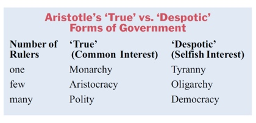
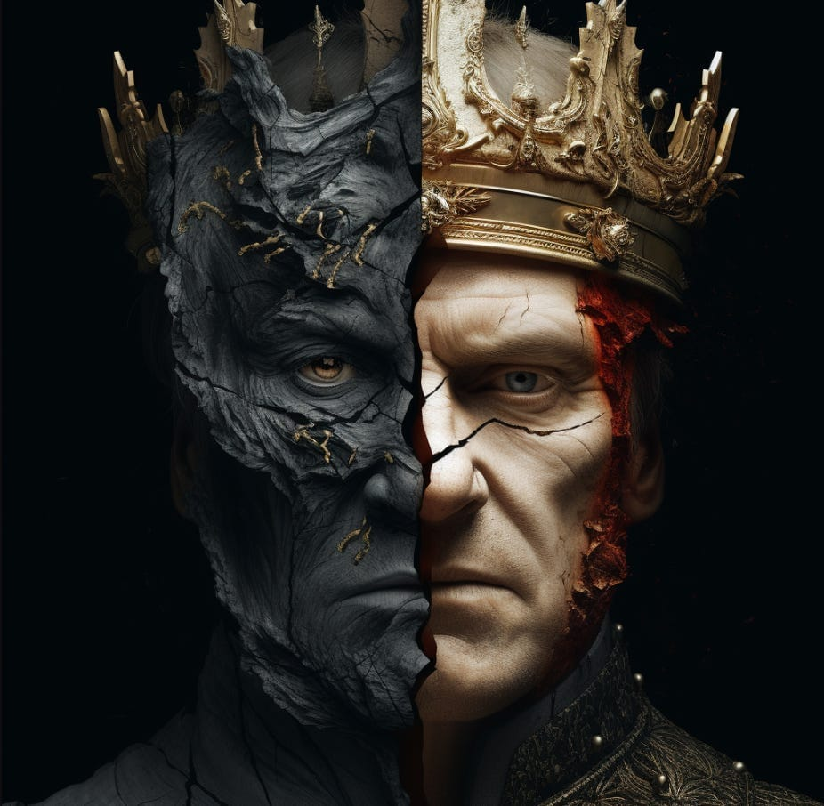

# Agenda and Announcements

## Agenda

- Today: Module 4 Quiz
- Today: Ethics and the Citizen
        
        - The Trolley Problem: Does delegating the switch matter?
        - Reciprocity
        - Back to Aristotle: voting and political participation

- Final Exams Schedule

# Ethics and the Citizen

## Citizenship

- Hopefully any of you who aren't citizens and want to be will get that opportunity soon.
- Although non-citizen residents don't vote, these principles still apply to residents in terms of relationships with government and with other people.
- So, other than voting, this extends beyond narrow legal citizenship.
- These also apply in whatever country one is a citizen of, though in non-democratic countries voting may not be enough.

## The Trolley Problem: Delegation

::: {.custom-style style="font-size: 80px;"}
Does delegating power over the switch change the ethical problem?
:::

## The Trolley Problem: Delegation

## The Trolley Problem: Delegation

::: {.custom-style style="font-size: 80px;"}
Who is morally culpable, the assassin or the client that hires him?
:::

## The Trolley Problem: Delegation

Who is responsible?

- The client is responsible for hiring the assassin, the assassin is amoral. It's just a job. The assassin is a weapon used by the client.
- The client is responsible for hiring the assassin and the assassin is responsible for taking the job. 
- The client is responsible for hiring the assassin, but the assassin is worse because whatever justification the client may have, the assassin is doing it just for the coin. 

## The Trolley Problem: Delegation

Who is responsible?

- No one reasonably claims the client is without guilt for setting the wheels in motion. 

## Delegation and Government

- If "governments are instituted among [humans] deriving their just power from the consent of the governed," who is the client and who is the hired muscle?
- We are the clients. Citizens, voters, and just voluntary residents who benefit from government in any way.
- Government is the hired muscle. Sometimes just muscle, sometimes killer. 

## The Trolley Problem: The Switch and a Gun

> At base, democracy is just a decision-making method. 18  In politics, democracy is a method for deciding when and how to coerce people into doing things they do not wish to do. Political democracy is a method for deciding (directly or indirectly) when, how, and in what ways a government will threaten people with violence. The symbol of democracy is not just the ballot—it is the ballot connected to a gun. 

- Jason Brennan, "The Ethics of Voting"^[
  Brennan, Jason. The Ethics of Voting. Princeton, N.J: Princeton University Press, 2011.
]

## The Trolley Problem: The Switch and a Gun

Two, three or more layers of responsibility:

- Voting for the government / leaders

- Leaders setting policies backed by coercive violence on when the switch gets pulled

- Coercive violence used to force someone to pull the switch

- Coercive violence used to pay the bills (taxation and taxation backed borrowing)

## Reciprocity

::: {.custom-style style="font-size: 60px;"}
> "What is hateful to you, do not do to your neighbor. That is the whole of the Torah. All else is commentary. Go and contemplate it."
:::

        - Hillel the Elder
        
        
        
## Reciprocity and voting?

::: {.custom-style style="font-size: 80px;"}
If voting is just delegating two things - the decision and the coercive enforcement - this one seems pretty simple...
:::

        
## Reciprocity and Voting

::: {.custom-style style="font-size: 60px;"}
> "What is hateful to you, do not vote for the government to do to your neighbor. That is the whole of ethics for the citizen. All else is commentary. Go and contemplate it."
:::

        - Me with apologies to Hillel
        
        

## Reciprocity and Civil Discourse

- Politics is always polarizing by nature
- Current American politics (as well as other countries) has become extremely polarized
- What can the principle of reciprocity tell us about how to properly discuss politics? Some ideas:

        - Respect the basic dignity of the other human being you are talking with
        - Consider the life experience of the person you are talking to
        - Assume good intentions on all parts: We may disagree about what is best or how to get it, but 97% of people want the best
        - Try to encourage the other parties to do the same
        - If the other person is stubbornly disrespectful, leave
        - If the other person won't discuss in good faith, considering all aspects, save the stress and leave

        

## Back to Aristotle

voting and political participation

- What is the fundamental difference between the True and Despotic forms of government?

## Aristotle True vs Despotic

## Back to Aristotle (2)

voting and political participation

- What is the fundamental difference between the True and Despotic forms of government?

- The selfish interest vs interest in the common good by whom?

## By the ruler {.nostretch}

{width="50%"}^[https://www.theleading-edge.org/the-tyrant-and-the-king/]

## Who is the ruler?

voting and political participation

- What is the fundamental difference between the True and Despotic forms of government?

- The interest in the common good vs selfish interest by whom?

        - The ruler!

- In Polity and Democracy who is the ruler?

## Government Types Aristotle

## Back to Aristotle

voting and political participation

- What is the fundamental difference between the True and Despotic forms of government?

- The interest in the common good vs selfish interest by whom?

        - The ruler!

- In Polity and Democracy who is the ruler?

        - The many = the voters! (and qualified non-voters)
        
        
## Voting and Non-voting

- Both voting and non-voting can have consequences
- Is it ever ethical not to vote?
- Is it ever unethical to vote?
- What is the ideal ethical way to approach voting?
- Is it ethical to sell your vote?
        
        
## The Folk Theory of Voting Ethics

-  "Each citizen has a civic duty to vote. In extenuating circumstances, one can be excused from voting, but otherwise, one should vote. "

- "While it is true that there can be better or worse candidates, in general any good faith vote is morally acceptable. At the very least, it is better to vote than to abstain. "

Brennan, *The Ethics of Voting*

## The Ethics of Voting

- There is a distinction between

        - The right to vote
        - The rightness of voting
        
- Everyone having the right to vote is fundamental to democracy
- Everyone exercising the right every time is not fundamental to democracy, especially if their vote will be questionable

## The Ethics of Voting: Bad Voting

- February 23, 1861, Texas held a referendum on secession from the Union
- At issue were several disagreements with the new President, Abraham Lincoln
- The most important of these issues were enforcement of the Fugitive Slave Act and the future of slavery

## Was Secession About Slavery?

> The citizens of each State shall be entitled to all the privileges and immunities of citizens in the several States; and shall have the right of transit and sojourn in any State of this Confederacy, with their slaves and other property; and the right of property in said slaves shall not be thereby impaired.

        - Article IV, Section 2, Clause 1, Constitution of the Confederate States of America
        - Adopted unanimously by the Congress of the Confederate States of South Carolina, Georgia, Florida, Alabama, Mississippi, Louisiana, and Texas.
        
        
## Lincoln and War
        
>If I could save the Union without freeing any slave I would do it, and if I could save it by freeing all the slaves I would do it; and if I could save it by freeing some and leaving others alone I would also do that.

        - Abraham Lincoln
        
- So secession was about slavery and was also, from the slaveholders point of view, a gratuitous vote for a predictable and avoidable war. 

- 46,153 Texans voted to secede 
- 14,747 voted against secession

- At the secession convention which called for the referendum, 70% of the participants were slaveholders voting in their narrow self-interest
- Even if they were self-interested voting for secession and war was not necessary to preserve their interest (which was still an unethical interest)

## The Common Good or Common Bad

- The common good:

        - 30% of the population were enslaved so slavery was not in the common good
        - Most of the white population did not own slaves so slavery was not in the common good
        - Secession led to the Civil War against the rich, industrialized North (predictable common bad)
        - In the aftermath of the Civil War, Texas endured the trials of Reconstruction (somewhat predictable common bad)
        
- On the other hand, the slaves were freed as part of the War (unpredictable common good) and might not have been freed for several more years without it. But that was not the voters intention.
        
        

## The Secession Vote

        
- Were the convention participants acting ethically?
- Were the voters acting in the common good?
- were the non-slaveowners who voted for secession acting ethically? in the common good?

## The Ethics of Voting

::: {.custom-style style="font-size: 60px;"}
To be super clear: stating that certain types of voting are unethical is not the same as stating that people who vote that way should be disenfranchised!
:::

Why not? Because most of us wouldn't want to be disenfranchised and..."What is hateful to you, do not vote for the government to do to your neighbor."

## The Ethics of Voting

::: {.custom-style style="font-size: 60px;"}
With all the necessary disclaimer and explanation out of the way. (But do rethink this for a moment before getting mad at Brennan's conclusion.)
:::

## The Ethics of Voting: Brennan concludes

- "Citizens have no civic or moral obligation to vote [because]
- Citizens can pay their debts to society and exercise civic virtue without being involved in politics. 
        
        - How might a citizen contribute more to society than voting?
        
        
## Brennan Conclusion 2

-  People who lack certain credentials (such as knowledge, rationality, and intellectual virtue) should abstain from voting.

        - What level of knowledge, rationality, and intellectual virtue given that democracy is supposed to be rule by all the people?

- Voters should not vote for narrow self-interest."

        - What is narrow self-interest? Does this differ from ANY self-interest?
        

## The Ethics of Voting

- Should you vote?
- What should you do if you are going to vote?
- Should you vote for common good or self-interest?

## The Ethics of Voting

- Should you vote?

        - If you want to invest the time to do it properly
        - If it matters to you
        - If you do not feel you can contribute as a citizen in more important ways using the same energy
     
     
## The Ethics of Voting

- Should you vote?
- What should you do if you are going to vote?  

        - Understand the issues
        - Really understand them at their core
        - Don't take the word of politicians or activists or a single expert in a narrow field (even college professors) on how things really work
        - and...
        
        
## The Ethics of Voting

- Should you vote?
- What should you do if you are going to vote?  
- Vote for the common good, not your **narrow** self-interest

## Ethics of Voting: Other considerations

- Most people do not vote ethically

- Distinguish between votes that take rights from others  and votes that preserve or enhance rights

        - if you vote to take someone else's rights to improve your own position, that is self-interested and unethical
        - voting to tax others to pay for something you want for your own benefit, but that the people paying for it don't want or benefit from 
        - Voting to tax others to pay for something for common good, that no one will voluntarily pay for without the guarantee that others will also pay for it
        
        
## Ethics of Voting: Other considerations        
        
- Voting in self-defense and defense of others is *often* ethical, even if it is self-interested

        - Voting to preserve your own lawful rights is self-interested and usually still ethical
        - Voting to preserve the rights of others may or may not be self-interested, but is almost always ethical
        

        

## Ethics of the Citizen

- Common good vs self-interest is much more complicated than just a utilitarian math problem

- Preserving your own rights in a society of equal protection under law *automatically* and *necessarily* preserves the rights of others - it is self-interested **and** for the common good

## Core Principles of Ethical Citizenship

- Thoughtfulness and deliberation
- Reciprocity
- Common good vs self-interest

## Authorship and License

Cover image created with Imagen 3.0, part of Google's Gemini.

Do not submit to Quizlet, Chegg, Coursehero, or other similar commercial websites.

- Author: Tom Hanna

- Website: <a href="https://tom-hanna.org/">tomhanna.me</a>

- License: This work is licensed under a <a href= "http://creativecommons.org/licenses/by-nc-sa/4.0/">Creative Commons Attribution-NonCommercial-ShareAlike 4.0 International License.</a>

