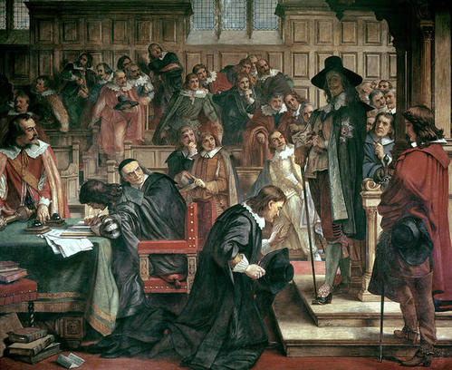

## Today

- The institutional "how" after republic vs democracy
- King as lawgiver, enforcer, and judge
- Article I as the break
- Tax, war, purse, impeachment, advice and consent

# Why This Matters

## Why This Matters

::: {.custom-style style="font-size: 44px;"}
By the end of today you will explain how Article I turns Congress into the institutional check on the executive, why the tax power continues the long struggle to take the purse from kings, and how powers such as declaring war that still belonged to George III in 1789 were assigned to Congress instead.
:::

# The problem

## Fused power

::: {.custom-style style="font-size: 48px;"}
The king as lawgiver, enforcer, and judge
:::

## King as three roles

{fig-alt="Educational diagram of a king combining the roles of lawgiver, enforcer, and judge" width="85%"}

## Parliament pushes back

{fig-alt="Historical painting of the Five Members episode illustrating conflict between king and Parliament" width="80%"}

# The break

## Congress breaks the fusion

{fig-alt="Diagram contrasting fused royal power with separated Congress, executive, and courts" width="90%"}

## Article I, Section 1

::: {.custom-style style="font-size: 46px;"}
"All legislative Powers herein granted shall be vested in a Congress of the United States"
:::

# The long tax path

## From charter to Constitution

{fig-alt="Horizontal timeline of the struggle over taxation from Magna Carta through 1689 to U.S. Article I" width="92%"}

## Magna Carta and consent

Extraordinary levies require consent — early limit on royal taking.

## Petition of Right (1628)

No forced loans; no non-Parliamentary taxation.

## Ship Money

The crown tests the limit; the conflict hardens the principle.

## Bill of Rights 1689

{fig-alt="Image related to the English Bill of Rights of 1689" width="70%"}

::: {.custom-style style="font-size: 42px;"}
Levying money for or to the use of the Crown by pretence of prerogative, without grant of Parliament … is illegal
:::

## Article I completes the transfer

- Power to tax: **Congress**
- Revenue bills: **originate in the House**
- No money from the Treasury except by **appropriations made by law**

# The purse

## Ship without water

{fig-alt="Illustration of executive power constrained without congressional appropriations" width="85%"}

## Power of the purse

::: {.custom-style style="font-size: 46px;"}
Declare all you want — without supply, the machine does not run
:::

# War power: a major break

## Britain, 1789

Crown prerogative: declare war and peace.

Parliament still holds the purse.

## United States Constitution

{fig-alt="Side-by-side comparison of British royal war prerogative in 1789 and U.S. congressional power to declare war" width="92%"}

## Article I assigns to Congress

- Declare war
- Raise and support armies (**no appropriation longer than two years**)
- Provide and maintain a navy
- Letters of marque and reprisal

## Understanding at the Founding

::: {.custom-style style="font-size: 46px;"}
A deliberate break from royal prerogative — modern war-powers disputes come later
:::

# Other constraints

## Impeachment

- House: sole power of impeachment
- Senate: sole power to try impeachments

Removal is the ultimate personal check on the executive.

## Advice and consent

Senate role in:

- Officers of the United States
- Treaties

The executive proposes; the Senate can block.

## Article I constraint map

{fig-alt="Icon diagram of Article I constraints including tax, appropriations, war, armies, impeachment, and advice and consent" width="90%"}

# Discussion

## Prompts

- Which constraint matters most in practice: tax, war declaration, purse, impeachment, or advice and consent?
- Why put revenue bills in the House first?
- Why limit army appropriations to two years?

# Next

## Next lecture

Limiting Congress — constraints on the legislature itself

## Reminders

- **Module 2 due October 9**
- **Module 2 quiz: October 12**

## Authorship and License

Do not submit to Quizlet, Chegg, Coursehero, or similar commercial sites.

| | |
|:---|:---|
| **Author** | Tom Hanna |
| **Website** | [tomhanna.me](https://tom-hanna.org/) |
| **License** | [CC BY-NC-SA 4.0](http://creativecommons.org/licenses/by-nc-sa/4.0/) |

[{fig-alt="Creative Commons Attribution-NonCommercial-ShareAlike 4.0 International License badge"}](http://creativecommons.org/licenses/by-nc-sa/4.0/)
