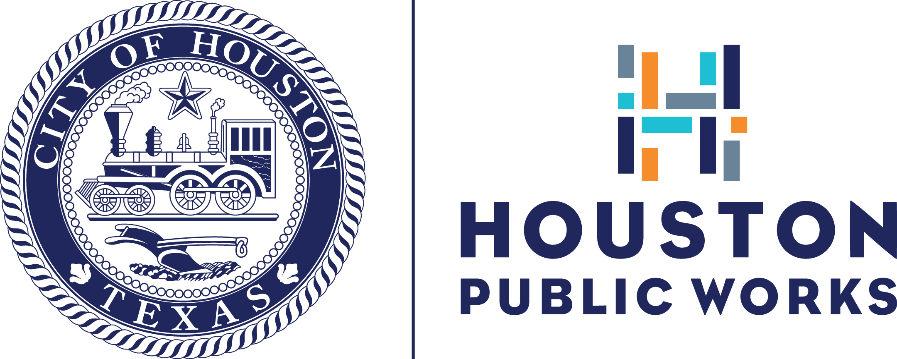
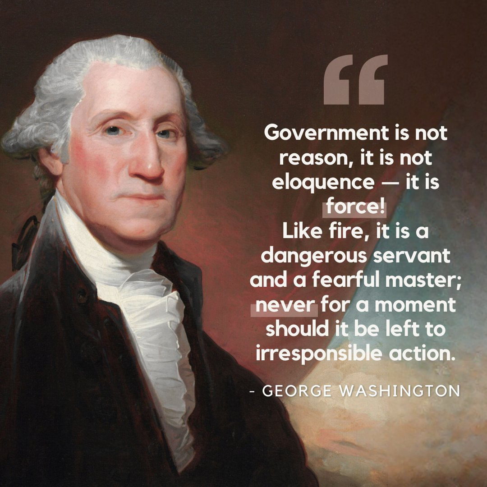
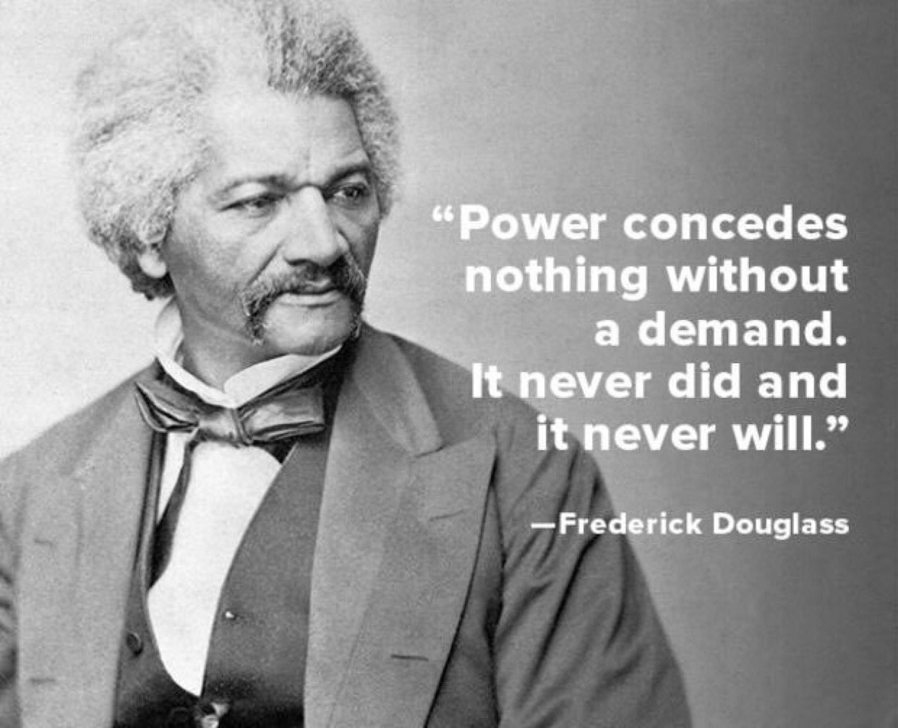

## Today

        - What is Government? What is politics?
        - Discussion: Experiences with Government
        - Questions
        

# Introduction to Government

## Introduction to Government

::: {.custom-style style="font-size: 80px;"}
To really understand government and politics we first need to know what those things are. 
:::

## Introduction Government: Questions to consider

:::{.custom-style style="font-size: 80px;"}
What is government or "The State"?
:::

## A word on words

- Government can mean multiple things

        - The specific group of people in charge of...
        - The enduring institution or organization we call government

- State has at least three meanings

        - International: State = independent country
        - United States: State = one of the 50 states
        - Political Science: State = government
        
- Politics

        - The process of making collective decisions in the context of the state or government

## What is government?

::: {.custom-style style="font-size: 80px;"}
How can we define government?
:::

- What government does?

## What is government?

::: {.custom-style style="font-size: 80px;"}
How can we define government?
:::

- What government does?

        - Then what is politics?

- What makes government unique?

        - What does this make politics?

        
## What government does?

::: {.custom-style style="font-size: 80px;"}
Before stepping on the campus today, what was the last time that politics made a difference in your life?
:::

## What is politics? 

- **Expensive or involves large amounts of money**
- **Distant**
- **Involves politicians or campaigns**
- **involves voting or decision making**
- **Involves rights**
- **National borders**
- **Controversial**

## What is politics: State and local (mostly)

{width="49%"}

## What is politics: Federal, state and local

{width="49%"} 

## What is politics: Federal, state and local

{width="49%"}

## What is politics? 

- **Not distant** 
- **immediate, right here**
- **touches everything**
- **direct impacts are constant**
- **involves all of us**
- **It can be expensive, but it's not always about money**

## Politics is powerful

- Immense power to achieve good ends 

## Politics is powerful

- Immense power to achieve good ends 
- Immense power to do incredible harm

## Politics is powerful

- Immense power to achieve good ends 
- Immense power to do incredible harm

## Politics is powerful

::: {.custom-style style="font-size: 3em;"}
Why does politics have such power to cause harm?
:::

## What does government do?

::: {.custom-style style="font-size: 80px;"}
These are all examples of *collective action*, organized action by a group of people to achieve a common goal.
:::

## What makes government different?

::: {.custom-style style="font-size: 80px;"}
What makes government or The State different from other organizations? Is collective action unique to government?
:::

## Other organizations - Group 1

- Family

        - What does it have in common?
        - What is different?

## Other organizations 

- Family
- Church

        - What does it (government) have in common?
        - What is different?

## Other organizations 

- Family
- Church
- Community organizations (voluntary)

        - What does it have in common?
        - What is different?

## Other organizations

- Family
- Church
- Community organizations (voluntary)
- Charities

        - What does it have in common?
        - What is different?

## Other organizations

- Family
- Church
- Community organizations (voluntary)
- Charities
- Businesses - The Market

        - What does it have in common?
        - What is different?
        

        

## Other organizations - Group 2

- Organized crime

        - What does it have in common?
        - What is different?

## Other organizations

- Organized crime
- vigilantes

        - What does it have in common?
        - What is different?

## Other organizations

- Organized crime
- vigilantes
- terrorists

        - What does it have in common?
        - What is different?
        
## Other organizations   

- For the Group 1 organizations, how can they enforce their rules?

For the Group 2 organizations, who are they responsible to and how do we view their use of force?

## What is "the state"?

**The organized, coercive use of violent force commonly accepted as legitimate** 

- organized
- Coercive use 
- violent force (armed force)
- Legitimacy
        

## Introduction Government: Questions to consider

:::{.custom-style style="font-size: 80px;"}
What is politics?
:::

## What is politics? 

- **Politics is the process of making collective decisions in the context of...**

## What is politics? 

- **Politics is the process of making collective decisions in the context of...**

The State or government.

## The difference between politics and everything else

These organizations all engage in collective action and collective decision making, but lack one thing the state has: 

- Family
- Church
- Community organizations (voluntary)
- Charities
- Businesses - The Market

## The difference between politics and everything else

These organizations all engage in collective action, but lack one thing the state has: 

- Family
- Church
- Community organizations (voluntary)
- Charities
- Businesses - The Market

**Coercive use of violent force**

## Studying other organizations

Family, church, the market, etc. are all about making collective decisions in: 

**The Voluntary Sphere**

## Politics is about

Making collective decisions in:

**The Coercive Sphere**

## Politics is powerful

{width="50%"}

## Politics is powerful

{width="50%"}

# Canvas and e-Book Overview

# Questions

## Next Lecture & Reminders

- **Next class (August 24):** Basic Ethics

- Be prepared to discuss personal ethics

        - What are ethically appropriate uses of physical force (violence)? 
        - How do you or should you make ethical decisions?
        - If you have to make a decision affecting the lives or property of others, how do you determing right from wrong?
        - We are not interested in the legal answers, but in the personal ethical answers if the law is not present
        

- **Following class (August 26):** Begin Constitutional Safeguards

## Upcoming Due Dates (from Syllabus)

- Module 0 substantially complete by **August 30** (avoid drop)
- Module 1 Study Guide and Connect due **September 18**
- Module 1 Quiz – In Class **September 21**

## Authorship and License

Do not submit to Quizlet, Chegg, Coursehero, or other similar commercial websites.

- Author: Tom Hanna

- Website: <a href="https://tom-hanna.org/">tomhanna.me</a>

- License: This work is licensed under a <a href= "http://creativecommons.org/licenses/by-nc-sa/4.0/">Creative Commons Attribution-NonCommercial-ShareAlike 4.0 International License.</a>

