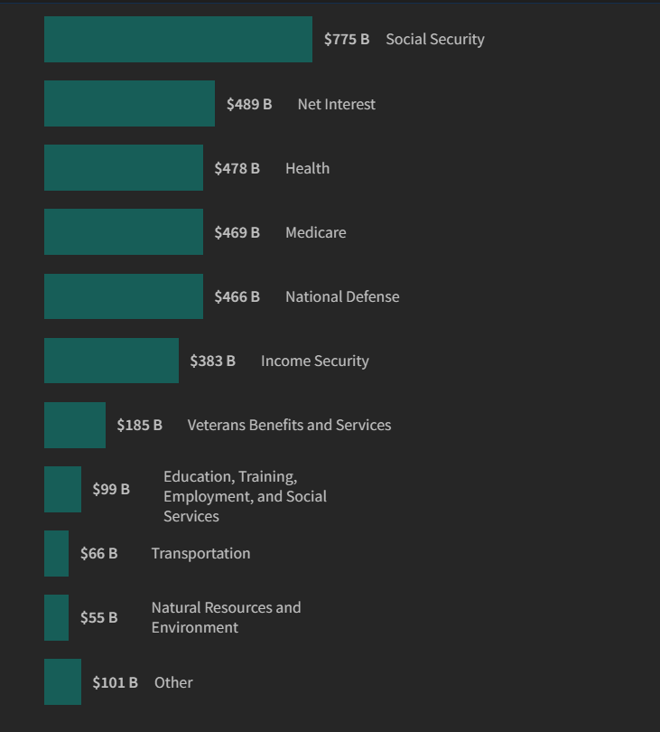

# Agenda and Announcements

## Agenda Today 

- Lecture: Trade-offs and Unintended Consequences

        - Short review - how today's topic fits
        - What are the trade-offs?
        - What are the costs?
        - Economic vs Social trade-offs
        - Short term vs long term trade-offs
        
        
- Discussion: Trade-offs and Unintended Consequences
        

## Upcoming Dates

- Semester Drawing to a close

- Module 3 Quiz August 3

        - Study Guide due Friday
        - Journals Due Monday
        - Connect Due Monday
        
- Module 4 Quiz August 4

        - Everything for Module 4 due Tuesday

- All late work due August 6

- Finals - August 5 and 6 per HCC schedule

-

# Trade-offs and Unintended Consequences

## Review

- We limit government because:

        - Government is the legitimate use of violent coercive force
        - The only unique domestic tool of government is some form of police and prisons
        - Force is "a dangerous servant and a fearful master"

- We enumerate individual rights because:

        - Specific lists eliminate confusion
        - This is an additional protection against the abuse of violent force 
        
- Why do we have government?

        - To secure the rights to life, liberty and property (core - original - hard to dispute)
        - To do the additional things that allow us to live together peacefully in a society of dignified equals (fuzzier - decided democratically)
        
        
## Where today fits

- The problems that make us want government to "do something" are only one part of deciding if certain laws or policies are good - often the least important part
- The violent force inherent in government is only one reason for this
        
        
## Federalist 10

Madison wrote in Federalist 10:

> If men were angels, no government would be necessary

## What if men were angels?

- Madison meant angels in the sense of **goodness*
- So, if government officials were always purely good in their intentions and absolutely incorruptible, would that be enough?
- Even if we were governed by perfectly good beings, what are some reasons we might still need to limit government?
- What are some reasons we might need to limit voters (ourselves)?

# Trade-offs

## What is a trade-off?

Think of your personal life

- Cheap used car no payments - repair bills; new car payments - warranty and comfort
- Fun and enjoyment - spending money; hard and boring work - making money
- You have \$3, you can buy a soda or a candy bar (or save the $3)
- Spending now vs. investing for the long term

## Government rade-offs: Collective Benefits vs Individual Rights

- Free riders and taxation
- Economic trade-offs

        - inflation vs unemployment
        - taxes vs economic growth
        - too high tax rates can reduce government revenue
        
        
- Public health vs. *vice* laws and excise taxes

        - alcohol tax
        - marijuana prohibition
        - cigarette taxes
        - prohibition of flavored cigarettes
        - soda taxes
        
        

## The trade-off
        
- The trade off: not just about *public benefit* vs *private wants and needs*
- benefit vs *cost of enforcement*
- *financial costs* of enforcement - just the beginning
- *Human costs of enforcement* 
- Remember the definition of government!

## John Hancock: Smuggler 1737-1793

## Eric Garner: Smuggler 1970-2014

 

Source: [Seven Last Words of the Unarmed](https://sevenlastwords.org/seven-lives/eric-garner/)

## Unintended Consequences Add Complexity

- Unintended consequences of public policy make it even more difficult to judge the trade-offs
- Unintended consequences: the results of actions that were not foreseen or intended by a purposeful action.

## Unintended consequences Examples

- Policy: Raising "sin" taxes 

        - People use less and revenue drops
        - Black markets are created - crime increases
        - Black market are created - revenue drops

- Policy: very high progressive income taxes

        - more later

## Unintended consequences Examples

- Raising "sin" taxes 
- Very high progressive income taxes
- Ban of pesticide DDT in 1972

        - millions of mosquito born illness deaths
        - sickness related financial costs to individuals, families, and governments

## Unintended consequences Examples

- Raising "sin" taxes 
- Very high progressive income taxes
- Ban of pesticide DDT in 1972
- Three strikes laws and capital punishment for rape or kidnapping

## Unintended consequences Examples

- Raising "sin" taxes 
- Very high progressive income taxes
- Ban of pesticide DDT in 1972
- Three strikes laws and capital punishment for rape or kidnapping

        - Criminals want no witnesses
        - increase in murders

        

        

## Unintended consequences Examples

[Ten Examples of Unintended Consequences](https://www.aei.org/carpe-diem/ten-examples-of-the-law-of-unintended-consequences/)

## Unintended Consequences 

- Unintended consequences are an important trade-off
- They are not *always* predictable 
- They should be *expected* and *considered*

## Road to Serfdom

- F.A. Hayek - Nobel Memorial Prize in Economic Sciences (1974)
- Instead of repealing bad economic regulations because of unintended consequences, we pass more more economic regulations with more unintended consequences

- WWII, response to totalitarianism in Nazi Germany and Soviet Russia

[The Road to Serfdom in Five Minutes](https://www.youtube.com/watch?v=mkz9AQhQFNY)

## Road to Serfdom

- F.A. Hayek - Nobel Memorial Prize in Economic Sciences (1974)
- Instead of repealing bad laws because of unintended consequences, we pass more laws with more unintended consequences

- Hayek focus: economic central planning

## Road to Serfdom

- F.A. Hayek - Nobel Memorial Prize in Economic Sciences (1974)
- Instead of repealing bad laws because of unintended consequences, we pass more laws with more unintended consequences

- Hayek focus: economic central planning
- What else could this apply to?

## Incarceration Rates

## Judging Public Policy Trade-offs: Economic and Social Trade-offs

- Poverty reduction versus climate change reduction
- Minimum wage increase versus job growth
- Subsidized healthcare versus inflation in healthcare prices
- Higher public spending vs higher deficits and inflation
- Education vs infrastructure
- Inequality vs. income growth

## Judging Public Policy Trade-offs: Economic and Social Trade-offs

 

Source: [What’s So Bad about Increasing Inequality in Canada?](https://irpp.org/research-studies/whats-so-bad-about-increasing-inequality-in-canada/)

## Judging Public Policy Trade-offs: Economic and Social Trade-offs

- Defense vs social services
- Free trade: more jobs overall vs job losses in some industries
- Costs of immigration vs economic growth contributions of immigrants
- inequality vs economic growth
- Tax rates vs tax revenue
- Tax rates vs economic growth

## Judging Public Policy Trade-offs: Economic and Social Trade-offs

Source: [Cato Institute](https://www.cato.org/blog/question-week-whats-right-point-laffer-curve)

## Judging Public Policy Trade-offs: Economic and Social Trade-offs

        - Does the Laffer Curve mean lowering taxes always increases revenue? 
        - Does the Laffer Curve tell us anything about economic growth?

Source: [Cato Institute](https://www.cato.org/blog/question-week-whats-right-point-laffer-curve)

## Judging Public Policy Trade-offs: Economic and Social Trade-offs

## Judging Public Policy Trade-offs: Short-term vs Long-term Benefits

- Higher taxes now vs. slower poverty reduction
- More consumption now vs. environmental issues later
- Higher spending now vs. Higher taxes later
- More educations spending now vs. economic growth later
- More infrastructure spending now vs. economic growth later
- More regulation now vs. fewer and lower paid jobs later
- Lower immigration now vs. population decline soon

## Recap

- Government is a dangerous solutiona and not the only solution
- Where government is the solution, trade-offs should be considered carefully including:

        - policy benefits versus individual freedoms and human costs
        - economic and social trade-offs
        - short-term versus long-term benefits
        
- The problem that makes us want government to "do something" is only one part of deciding if a policy is good - often the least important part
                

## Authorship and License

Cover image created with Imagen 3.0, part of Google's Gemini.

Do not submit to Quizlet, Chegg, Coursehero, or other similar commercial websites.

- Author: Tom Hanna

- Website: <a href="https://tom-hanna.org/">tomhanna.me</a>

- License: This work is licensed under a <a href= "http://creativecommons.org/licenses/by-nc-sa/4.0/">Creative Commons Attribution-NonCommercial-ShareAlike 4.0 International License.</a>

